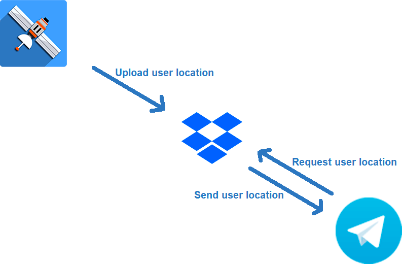

# Find My Phone Telegram BOT
This project is a Telegram bot to access location data stored in Dropbox as GeoJSON files from GPSLogger app. The bot allows users to query the latest location information for different individuals.

## Features

- Retrieves location information from GeoJSON files in Dropbox.
- Sends the last recorded location to Telegram, including details such as:
  - Latitude and Longitude
  - Altitude
  - Accuracy
  - Last update
- Interactive menu with configurable commands for different users.

## Configuration

### Prerequisites

- [Dropbox](https://www.dropbox.com/developers/reference/getting-started#app%20console): create an account and setup your own app.
- [GPSLogger](https://github.com/mendhak/gpslogger/releases): install the app and setup on the target device.
  - Save logs in GeoJSON format.
  - Use a customizable name in the format: personName_YYYY-MM-DD.geojson
  - Save the time with time zone offset.
  - Enable and setup automatic upload to Dropbox.
- [Telegram bot](https://core.telegram.org/bots/tutorial#obtain-your-bot-token): configure and obtain the token.

### Installation

1. Clone this repository:
   ```bash
   git clone https://github.com/alan7s/find-my-phone-telegram-bot
   cd find-my-phone-telegram-bot

2. Install dependencies:
   ```bash
   pip install -r requirements.txt

3. Configure the variables in the .env file:
- Dropbox:
  - DROPBOX_APPKEY: Dropbox app key.
  - DROPBOX_APPSECRET: Dropbox app secret.
  - DROPBOX_REFRESH_TOKEN: OAuth2 [refresh token](https://www.limontec.com/2024/08/dropbox-como-obter-refresh-token.html).
  - Paths to the GeoJSON files in Dropbox:
    - GEOJSON_PATH_PERSON_A
    - GEOJSON_PATH_PERSON_B
    - GEOJSON_PATH_PERSON_C
- Telegram:
  - TELEGRAM_API: Telegram bot token.
  - CHAT_ID: Chat ID where messages will be sent.

4. Start the bot:
   ```bash
   python3 bot-server.py

## Usage

### Available Commands
  - /get_personName_location: Retrieves the last recorded location for a person.

### Default Response
The bot displays the menu with available options if the sent command is not recognized.

## Running in background
1. To start the bot-server:
   ```bash
   nohup python3 -u bot-server.py > output.log &

2. Finding the process ID:
   ```bash
   ps ax | grep bot-server.py
   
3. To stop the bot-server, kill the process:
   ```bash
   kill PID

## Contribution
Contributions are welcome! Feel free to open issues or submit pull requests.
